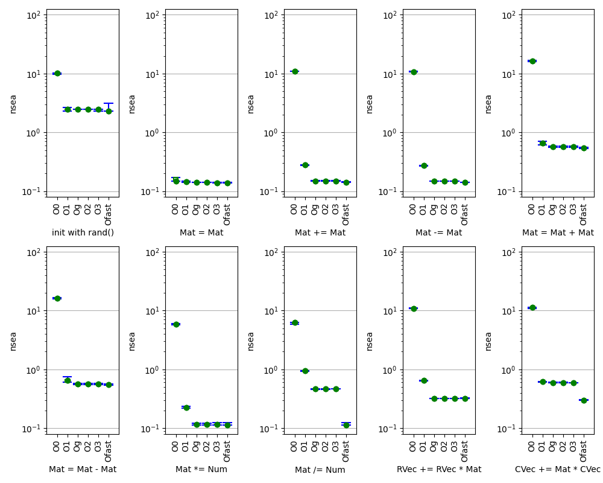

Benchmark Results with Plots

* Mat<R,C,double>

** Plots and Methodology

The goal of the mat benchmark program is to do several iterations
of the mat benchmark suite, all with the same R, and each taking
somewhere around a configured time to run.

To do this, we need to do two runs. The first run will have the usual
one-time-only Cold Cache penalty, but we use its elapsed time to tune
the R value for the second run. The second run is Warm Cache, and we
use its run time for the final tuning of R for the recorded runs.

Once a value of R is selected, the suite is run repeatedly until
the elapsed time exceeds the configured limit, and a summary of the
runs is generated.

** Benchmark Results from "benches" output

make: Entering directory '/home/glimes/Projects/Mathing'
[RUN BENCHMARK] mat

Benchmarking with N=1000
All durations reported in ns per element.
Each matrix uses 8000000 bytes of storage.
Target time per pass: 5 seconds.
Target time for run: 60 seconds.

For R=10, T=0.94; want T=5, will use R=53

Benchmark ending after 12 repetitions of the suite;
Total elapsed time: 62 seconds
#+tblname: bench_mat_O0
|      min |      25% |      50% |      75% |      max | operation                        |
|----------|----------|----------|----------|----------|----------------------------------|
|    9.774 |    9.777 |   10.100 |   10.268 |   10.275 | init with rand()                 |
|    0.150 |    0.150 |    0.150 |    0.169 |    0.169 | Mat = Mat                        |
|   10.851 |   10.902 |   10.922 |   10.938 |   10.996 | Mat += Mat                       |
|   10.700 |   10.753 |   10.771 |   10.995 |   11.053 | Mat -= Mat                       |
|   16.041 |   16.101 |   16.192 |   16.699 |   16.789 | Mat = Mat + Mat                  |
|   15.894 |   15.952 |   16.046 |   16.474 |   16.510 | Mat = Mat - Mat                  |
|    5.706 |    5.725 |    5.834 |    5.873 |    5.930 | Mat *= Num                       |
|    5.907 |    5.949 |    6.228 |    6.231 |    6.250 | Mat /= Num                       |
|   10.801 |   10.866 |   10.884 |   10.959 |   11.036 | RVec += RVec * Mat               |
|   10.877 |   10.940 |   11.297 |   11.318 |   11.357 | CVec += Mat * CVec               |

[PROFILE BENCHMARK] mat
make: Leaving directory '/home/glimes/Projects/Mathing'
make: Entering directory '/home/glimes/Projects/Mathing'
[RUN BENCHMARK] mat

Benchmarking with N=1000
All durations reported in ns per element.
Each matrix uses 8000000 bytes of storage.
Target time per pass: 5 seconds.
Target time for run: 60 seconds.

For R=1000, T=4.45; want T=5, will use R=1124

Benchmark ending after 12 repetitions of the suite;
Total elapsed time: 65 seconds
#+tblname: bench_mat_O1
|      min |      25% |      50% |      75% |      max | operation                        |
|----------|----------|----------|----------|----------|----------------------------------|
|    2.322 |    2.485 |    2.485 |    2.487 |    2.651 | init with rand()                 |
|    0.141 |    0.143 |    0.145 |    0.146 |    0.149 | Mat = Mat                        |
|    0.271 |    0.272 |    0.279 |    0.279 |    0.280 | Mat += Mat                       |
|    0.267 |    0.269 |    0.275 |    0.276 |    0.277 | Mat -= Mat                       |
|    0.610 |    0.619 |    0.661 |    0.667 |    0.710 | Mat = Mat + Mat                  |
|    0.604 |    0.612 |    0.653 |    0.669 |    0.740 | Mat = Mat - Mat                  |
|    0.217 |    0.218 |    0.222 |    0.223 |    0.233 | Mat *= Num                       |
|    0.923 |    0.929 |    0.944 |    0.946 |    0.953 | Mat /= Num                       |
|    0.629 |    0.631 |    0.643 |    0.643 |    0.644 | RVec += RVec * Mat               |
|    0.608 |    0.610 |    0.621 |    0.622 |    0.622 | CVec += Mat * CVec               |

[PROFILE BENCHMARK] mat
make: Leaving directory '/home/glimes/Projects/Mathing'
make: Entering directory '/home/glimes/Projects/Mathing'
[RUN BENCHMARK] mat

Benchmarking with N=1000
All durations reported in ns per element.
Each matrix uses 8000000 bytes of storage.
Target time per pass: 5 seconds.
Target time for run: 60 seconds.

For R=100, T=0.65; want T=5, will use R=764

Benchmark ending after 12 repetitions of the suite;
Total elapsed time: 64 seconds
#+tblname: bench_mat_Og
|      min |      25% |      50% |      75% |      max | operation                        |
|----------|----------|----------|----------|----------|----------------------------------|
|    2.487 |    2.487 |    2.488 |    2.489 |    2.653 | init with rand()                 |
|    0.139 |    0.139 |    0.141 |    0.141 |    0.145 | Mat = Mat                        |
|    0.548 |    0.556 |    0.564 |    0.574 |    0.581 | Mat += Mat                       |
|    0.530 |    0.532 |    0.533 |    0.535 |    0.548 | Mat -= Mat                       |
|    0.834 |    0.838 |    0.844 |    0.853 |    0.855 | Mat = Mat + Mat                  |
|    0.808 |    0.815 |    0.818 |    0.827 |    0.859 | Mat = Mat - Mat                  |
|    0.655 |    0.659 |    0.662 |    0.664 |    0.689 | Mat *= Num                       |
|    1.358 |    1.373 |    1.384 |    1.399 |    1.418 | Mat /= Num                       |
|    0.781 |    0.782 |    0.783 |    0.784 |    0.790 | RVec += RVec * Mat               |
|    0.642 |    0.643 |    0.644 |    0.645 |    0.651 | CVec += Mat * CVec               |

[PROFILE BENCHMARK] mat
make: Leaving directory '/home/glimes/Projects/Mathing'
make: Entering directory '/home/glimes/Projects/Mathing'
[RUN BENCHMARK] mat

Benchmarking with N=1000
All durations reported in ns per element.
Each matrix uses 8000000 bytes of storage.
Target time per pass: 5 seconds.
Target time for run: 60 seconds.

For R=1000, T=3.09; want T=5, will use R=1616

Benchmark ending after 12 repetitions of the suite;
Total elapsed time: 64 seconds
#+tblname: bench_mat_O2
|      min |      25% |      50% |      75% |      max | operation                        |
|----------|----------|----------|----------|----------|----------------------------------|
|    2.486 |    2.487 |    2.487 |    2.488 |    2.488 | init with rand()                 |
|    0.140 |    0.140 |    0.140 |    0.141 |    0.143 | Mat = Mat                        |
|    0.147 |    0.148 |    0.148 |    0.149 |    0.153 | Mat += Mat                       |
|    0.147 |    0.147 |    0.147 |    0.148 |    0.149 | Mat -= Mat                       |
|    0.559 |    0.560 |    0.564 |    0.568 |    0.581 | Mat = Mat + Mat                  |
|    0.554 |    0.556 |    0.561 |    0.568 |    0.579 | Mat = Mat - Mat                  |
|    0.114 |    0.115 |    0.115 |    0.115 |    0.122 | Mat *= Num                       |
|    0.461 |    0.462 |    0.463 |    0.465 |    0.466 | Mat /= Num                       |
|    0.318 |    0.318 |    0.319 |    0.320 |    0.320 | RVec += RVec * Mat               |
|    0.594 |    0.595 |    0.597 |    0.598 |    0.601 | CVec += Mat * CVec               |

[PROFILE BENCHMARK] mat
make: Leaving directory '/home/glimes/Projects/Mathing'
make: Entering directory '/home/glimes/Projects/Mathing'
[RUN BENCHMARK] mat

Benchmarking with N=1000
All durations reported in ns per element.
Each matrix uses 8000000 bytes of storage.
Target time per pass: 5 seconds.
Target time for run: 60 seconds.

For R=1000, T=3.08; want T=5, will use R=1623

Benchmark ending after 12 repetitions of the suite;
Total elapsed time: 65 seconds
#+tblname: bench_mat_O3
|      min |      25% |      50% |      75% |      max | operation                        |
|----------|----------|----------|----------|----------|----------------------------------|
|    2.321 |    2.486 |    2.487 |    2.488 |    2.488 | init with rand()                 |
|    0.139 |    0.139 |    0.139 |    0.140 |    0.142 | Mat = Mat                        |
|    0.147 |    0.147 |    0.147 |    0.147 |    0.151 | Mat += Mat                       |
|    0.147 |    0.147 |    0.147 |    0.147 |    0.149 | Mat -= Mat                       |
|    0.563 |    0.565 |    0.568 |    0.578 |    0.586 | Mat = Mat + Mat                  |
|    0.554 |    0.557 |    0.564 |    0.567 |    0.574 | Mat = Mat - Mat                  |
|    0.114 |    0.115 |    0.115 |    0.116 |    0.124 | Mat *= Num                       |
|    0.462 |    0.462 |    0.462 |    0.464 |    0.466 | Mat /= Num                       |
|    0.318 |    0.319 |    0.319 |    0.320 |    0.321 | RVec += RVec * Mat               |
|    0.594 |    0.595 |    0.596 |    0.597 |    0.598 | CVec += Mat * CVec               |

[PROFILE BENCHMARK] mat
make: Leaving directory '/home/glimes/Projects/Mathing'
make: Entering directory '/home/glimes/Projects/Mathing'
[RUN BENCHMARK] mat

Benchmarking with N=1000
All durations reported in ns per element.
Each matrix uses 8000000 bytes of storage.
Target time per pass: 5 seconds.
Target time for run: 60 seconds.

For R=1000, T=2.38; want T=5, will use R=2097

Benchmark ending after 12 repetitions of the suite;
Total elapsed time: 65 seconds
#+tblname: bench_mat_Ofast
|      min |      25% |      50% |      75% |      max | operation                        |
|----------|----------|----------|----------|----------|----------------------------------|
|    2.306 |    2.322 |    2.322 |    2.322 |    3.150 | init with rand()                 |
|    0.139 |    0.139 |    0.139 |    0.140 |    0.142 | Mat = Mat                        |
|    0.142 |    0.142 |    0.142 |    0.143 |    0.145 | Mat += Mat                       |
|    0.142 |    0.142 |    0.143 |    0.143 |    0.143 | Mat -= Mat                       |
|    0.528 |    0.531 |    0.539 |    0.546 |    0.557 | Mat = Mat + Mat                  |
|    0.535 |    0.541 |    0.546 |    0.547 |    0.562 | Mat = Mat - Mat                  |
|    0.114 |    0.114 |    0.114 |    0.114 |    0.124 | Mat *= Num                       |
|    0.114 |    0.114 |    0.114 |    0.115 |    0.124 | Mat /= Num                       |
|    0.319 |    0.319 |    0.320 |    0.320 |    0.326 | RVec += RVec * Mat               |
|    0.299 |    0.300 |    0.300 |    0.300 |    0.303 | CVec += Mat * CVec               |

[PROFILE BENCHMARK] mat
make: Leaving directory '/home/glimes/Projects/Mathing'

** column headers

#+tblname: bench_mat_cols
| min | 25% | 50% | 75% | max | operation |

** python code

*** imports

#+begin_src python :session :results none

  import math
  import matplotlib.pyplot as plt
  import matplotlib.patches as patches
  import numpy as np

#+end_src

*** def gen_dmap():

#+begin_src python :session :results none

  def gen_dmap(tables, tnames):
      dmap = {}
      oporder = []
      for tbl, name in zip(tables, tnames):
          for row in tbl:
              lo, q1, q2, q3, hi, op = row
              if op not in dmap:
                  oporder.append(op)
                  dmap[op] = {}
              dmap[op][name] = [lo, q1, q2, q3, hi]
      return dmap, oporder

#+end_src

*** def print_dmap(dmap, oporder, tnames):

#+begin_src python :session :results none

  def print_dmap(dmap, oporder, tnames, cols):
      cols[0][-1] = ""
      head = " | ".join([f"{x:8}" for x in cols[0]])
      dash = "-|-".join(["-"*8 for x in cols[0]])
      for op in oporder:
          print(f"")
          print(f"Nanoseconds per element for {op}:")
          print(f"| {head} |")
          print(f"|-{dash}-|")
          for name in tnames:
              s = " | ".join(f"{x:8.3f}" for x in dmap[op][name])
              print(f"| {s} | {name:8} |")

#+end_src

*** def plot_dmap(dmap, oporder, tnames, figname):

#+begin_src python :session :results none

  def plot_dmap(dmap, oprows, tnames, figname):
      opnr = len(oprows)
      opnc = 1
      for oprow in oprows:
          if opnc < len(oprow):
              opnc = len(oprow)
      fig, axes = plt.subplots(figsize=(2*opnc, 4*opnr), nrows=opnr, ncols=opnc)
      # TODO: what if nrows is 1?
      # TODO: what if ncols is 1?

      ymax = 1.0
      for opri, opr in enumerate(oprows):
        for opci, op in enumerate(opr):
          for name in tnames:
              dmin, d1, d2, d3, dmax = dmap[op][name]
              while ymax < dmax: ymax *= 10.0

      ymin = 0.1
      for opri, opr in enumerate(oprows):
        for opci, op in enumerate(opr):
          for name in tnames:
              dmin, d1, d2, d3, dmax = dmap[op][name]
              while ymin > dmin: ymin /= 10.0
      if ymin < 0.001: ymin = 0.001

      for opri, opr in enumerate(oprows):
        for opci, op in enumerate(opr):
          ax = axes[opri, opci]
          ax.set_xlabel(op)
          ax.set_ylabel("nsea")

          xtick_s = []
          xtick_x = []
          x = 0
          for name in tnames:
              x += 1
              data = dmap[op][name]
              dmin, d1, d2, d3, dmax = data

              x1 = x + 0.1
              x3 = x + 0.3
              x5 = x + 0.5
              x7 = x + 0.7
              x9 = x + 0.9

              sw = [x1, x9]
              sn = [x3, x7]

              xl = [x3, x3]
              xc = [x5, x5]
              xr = [x7, x7]

              xtick_x.append(x5)
              xtick_s.append(name)

              ax.plot(xl, [d1, d3], 'g')
              ax.plot(xr, [d1, d3], 'g')
              ax.plot(xc, [dmin, d1], 'b')
              ax.plot(xc, [d3, dmax], 'b')

              ax.plot(sw, [dmin, dmin], 'b')
              ax.plot(sw, [dmax, dmax], 'b')

              ax.plot(sn, [d1, d1], 'g')
              ax.plot(sn, [d3, d3], 'g')

              ax.plot([x5, x5], [d2, d2], 'go')

          ax.set_xlim(0.5, x+1.5)
          # OPTIONAL: use log scale
          ax.set_yscale('log', base=10)
          ax.set_ylim(ymin*0.80, ymax*1.25)
          # ax.set_ylim(0.0, ymax*1.25)
          ax.tick_params(axis='x', labelsize=10)
          ax.grid(axis='y')
          ax.set_xticks(xtick_x, xtick_s, rotation=90)

      plt.tight_layout()

      plt.savefig(figname)
#+end_src

*** def print_relative_time(dmap, oporder, tnames):

#+begin_src python :session :results none

  def print_relative_time(dmap, oprows, tnames, ref):
      print()
      print(f"Time relative to {ref} (smaller is better):")

      op = "operation"
      print(f"| {op:32}", end=' ')
      for name in tnames:
          print(f"| {name:>8}", end=' ')
      print("|")

      op = "-" * 32;
      print(f"|-{op:32}", end='-')
      for name in tnames:
          name = "-" * 8;
          print(f"|-{name:>8}", end='-')
      print("|")

      for opri, opr in enumerate(oprows):
          for opci, op in enumerate(opr):
              data = [dmap[op][name][2] for name in tnames]
              refdata = dmap[op][ref][2]
              strs = " | ".join([f"{d/refdata:8.2f}" for d in data])
              print(f"| {op:32} | {strs} |")

#+end_src

*** def print_relative_speed(dmap, oporder, tnames):

#+begin_src python :session :results none

  def print_relative_speed(dmap, oprows, tnames, ref):
      print()
      print(f"Speed relative to {ref} (larger is better):")

      op = "operation"
      print(f"| {op:32}", end=' ')
      for name in tnames:
          print(f"| {name:>8}", end=' ')
      print("|")

      op = "-" * 32;
      print(f"|-{op:32}", end='-')
      for name in tnames:
          name = "-" * 8;
          print(f"|-{name:>8}", end='-')
      print("|")

      for opri, opr in enumerate(oprows):
          for opci, op in enumerate(opr):
              data = [dmap[op][name][2] for name in tnames]
              refdata = dmap[op][ref][2]
              strs = " | ".join([f"{refdata/d:8.2f}" for d in data])
              print(f"| {op:32} | {strs} |")

#+end_src

** make the plots and re-print the data

#+begin_src python :session :results output :var tbl_O0=bench_mat_O0 tbl_O1=bench_mat_O1 tbl_Og=bench_mat_Og tbl_O2=bench_mat_O2 tbl_O3=bench_mat_O3 tbl_Ofast=bench_mat_Ofast cols=bench_mat_cols

  tables = [tbl_O0, tbl_O1, tbl_O2, tbl_O2, tbl_O3, tbl_Ofast]
  tnames = ["O0",   "O1",   "Og",   "O2",   "O3",   "Ofast"  ]

  # OPTIONAL: discard O0 results
  # tables = tables[1:]
  # tnames = tnames[1:]

  dmap, oporder = gen_dmap(tables, tnames)
  # OPTIONAL: discard "init with rand()" results
  # oporder = oporder[1:]

  print_relative_time(dmap, oprows, tnames, 'Og')
  print_relative_speed(dmap, oprows, tnames, 'Og')

  oprows = [oporder[0:5], oporder[5:]]
  plot_dmap(dmap, oprows, tnames, "bench-mat.png")
  print_dmap(dmap, oporder, tnames, cols)

#+end_src

#+RESULTS:
#+begin_example

Time relative to Og (smaller is better):
| operation                        |       O0 |       O1 |       Og |       O2 |       O3 |    Ofast |
|----------------------------------|----------|----------|----------|----------|----------|----------|
| Mat = Mat                        |     1.07 |     1.04 |     1.00 |     1.00 |     0.99 |     0.99 |
| Mat += Mat                       |    73.80 |     1.89 |     1.00 |     1.00 |     0.99 |     0.96 |
| Mat -= Mat                       |    73.27 |     1.87 |     1.00 |     1.00 |     1.00 |     0.97 |
| Mat = Mat + Mat                  |    28.71 |     1.17 |     1.00 |     1.00 |     1.01 |     0.96 |
| Mat = Mat - Mat                  |    28.60 |     1.16 |     1.00 |     1.00 |     1.01 |     0.97 |
| Mat *= Num                       |    50.73 |     1.93 |     1.00 |     1.00 |     1.00 |     0.99 |
| Mat /= Num                       |    13.45 |     2.04 |     1.00 |     1.00 |     1.00 |     0.25 |
| RVec += RVec * Mat               |    34.12 |     2.02 |     1.00 |     1.00 |     1.00 |     1.00 |
| CVec += Mat * CVec               |    18.92 |     1.04 |     1.00 |     1.00 |     1.00 |     0.50 |

Speed relative to Og (larger is better):
| operation                        |       O0 |       O1 |       Og |       O2 |       O3 |    Ofast |
|----------------------------------|----------|----------|----------|----------|----------|----------|
| Mat = Mat                        |     0.93 |     0.97 |     1.00 |     1.00 |     1.01 |     1.01 |
| Mat += Mat                       |     0.01 |     0.53 |     1.00 |     1.00 |     1.01 |     1.04 |
| Mat -= Mat                       |     0.01 |     0.53 |     1.00 |     1.00 |     1.00 |     1.03 |
| Mat = Mat + Mat                  |     0.03 |     0.85 |     1.00 |     1.00 |     0.99 |     1.05 |
| Mat = Mat - Mat                  |     0.03 |     0.86 |     1.00 |     1.00 |     0.99 |     1.03 |
| Mat *= Num                       |     0.02 |     0.52 |     1.00 |     1.00 |     1.00 |     1.01 |
| Mat /= Num                       |     0.07 |     0.49 |     1.00 |     1.00 |     1.00 |     4.06 |
| RVec += RVec * Mat               |     0.03 |     0.50 |     1.00 |     1.00 |     1.00 |     1.00 |
| CVec += Mat * CVec               |     0.05 |     0.96 |     1.00 |     1.00 |     1.00 |     1.99 |

Nanoseconds per element for init with rand():
| min      | 25%      | 50%      | 75%      | max      |          |
|----------|----------|----------|----------|----------|----------|
|    9.774 |    9.777 |   10.100 |   10.268 |   10.275 | O0       |
|    2.322 |    2.485 |    2.485 |    2.487 |    2.651 | O1       |
|    2.486 |    2.487 |    2.487 |    2.488 |    2.488 | Og       |
|    2.486 |    2.487 |    2.487 |    2.488 |    2.488 | O2       |
|    2.321 |    2.486 |    2.487 |    2.488 |    2.488 | O3       |
|    2.306 |    2.322 |    2.322 |    2.322 |    3.150 | Ofast    |

Nanoseconds per element for Mat = Mat:
| min      | 25%      | 50%      | 75%      | max      |          |
|----------|----------|----------|----------|----------|----------|
|    0.150 |    0.150 |    0.150 |    0.169 |    0.169 | O0       |
|    0.141 |    0.143 |    0.145 |    0.146 |    0.149 | O1       |
|    0.140 |    0.140 |    0.140 |    0.141 |    0.143 | Og       |
|    0.140 |    0.140 |    0.140 |    0.141 |    0.143 | O2       |
|    0.139 |    0.139 |    0.139 |    0.140 |    0.142 | O3       |
|    0.139 |    0.139 |    0.139 |    0.140 |    0.142 | Ofast    |

Nanoseconds per element for Mat += Mat:
| min      | 25%      | 50%      | 75%      | max      |          |
|----------|----------|----------|----------|----------|----------|
|   10.851 |   10.902 |   10.922 |   10.938 |   10.996 | O0       |
|    0.271 |    0.272 |    0.279 |    0.279 |    0.280 | O1       |
|    0.147 |    0.148 |    0.148 |    0.149 |    0.153 | Og       |
|    0.147 |    0.148 |    0.148 |    0.149 |    0.153 | O2       |
|    0.147 |    0.147 |    0.147 |    0.147 |    0.151 | O3       |
|    0.142 |    0.142 |    0.142 |    0.143 |    0.145 | Ofast    |

Nanoseconds per element for Mat -= Mat:
| min      | 25%      | 50%      | 75%      | max      |          |
|----------|----------|----------|----------|----------|----------|
|   10.700 |   10.753 |   10.771 |   10.995 |   11.053 | O0       |
|    0.267 |    0.269 |    0.275 |    0.276 |    0.277 | O1       |
|    0.147 |    0.147 |    0.147 |    0.148 |    0.149 | Og       |
|    0.147 |    0.147 |    0.147 |    0.148 |    0.149 | O2       |
|    0.147 |    0.147 |    0.147 |    0.147 |    0.149 | O3       |
|    0.142 |    0.142 |    0.143 |    0.143 |    0.143 | Ofast    |

Nanoseconds per element for Mat = Mat + Mat:
| min      | 25%      | 50%      | 75%      | max      |          |
|----------|----------|----------|----------|----------|----------|
|   16.041 |   16.101 |   16.192 |   16.699 |   16.789 | O0       |
|    0.610 |    0.619 |    0.661 |    0.667 |    0.710 | O1       |
|    0.559 |    0.560 |    0.564 |    0.568 |    0.581 | Og       |
|    0.559 |    0.560 |    0.564 |    0.568 |    0.581 | O2       |
|    0.563 |    0.565 |    0.568 |    0.578 |    0.586 | O3       |
|    0.528 |    0.531 |    0.539 |    0.546 |    0.557 | Ofast    |

Nanoseconds per element for Mat = Mat - Mat:
| min      | 25%      | 50%      | 75%      | max      |          |
|----------|----------|----------|----------|----------|----------|
|   15.894 |   15.952 |   16.046 |   16.474 |   16.510 | O0       |
|    0.604 |    0.612 |    0.653 |    0.669 |    0.740 | O1       |
|    0.554 |    0.556 |    0.561 |    0.568 |    0.579 | Og       |
|    0.554 |    0.556 |    0.561 |    0.568 |    0.579 | O2       |
|    0.554 |    0.557 |    0.564 |    0.567 |    0.574 | O3       |
|    0.535 |    0.541 |    0.546 |    0.547 |    0.562 | Ofast    |

Nanoseconds per element for Mat *= Num:
| min      | 25%      | 50%      | 75%      | max      |          |
|----------|----------|----------|----------|----------|----------|
|    5.706 |    5.725 |    5.834 |    5.873 |    5.930 | O0       |
|    0.217 |    0.218 |    0.222 |    0.223 |    0.233 | O1       |
|    0.114 |    0.115 |    0.115 |    0.115 |    0.122 | Og       |
|    0.114 |    0.115 |    0.115 |    0.115 |    0.122 | O2       |
|    0.114 |    0.115 |    0.115 |    0.116 |    0.124 | O3       |
|    0.114 |    0.114 |    0.114 |    0.114 |    0.124 | Ofast    |

Nanoseconds per element for Mat /= Num:
| min      | 25%      | 50%      | 75%      | max      |          |
|----------|----------|----------|----------|----------|----------|
|    5.907 |    5.949 |    6.228 |    6.231 |    6.250 | O0       |
|    0.923 |    0.929 |    0.944 |    0.946 |    0.953 | O1       |
|    0.461 |    0.462 |    0.463 |    0.465 |    0.466 | Og       |
|    0.461 |    0.462 |    0.463 |    0.465 |    0.466 | O2       |
|    0.462 |    0.462 |    0.462 |    0.464 |    0.466 | O3       |
|    0.114 |    0.114 |    0.114 |    0.115 |    0.124 | Ofast    |

Nanoseconds per element for RVec += RVec * Mat:
| min      | 25%      | 50%      | 75%      | max      |          |
|----------|----------|----------|----------|----------|----------|
|   10.801 |   10.866 |   10.884 |   10.959 |   11.036 | O0       |
|    0.629 |    0.631 |    0.643 |    0.643 |    0.644 | O1       |
|    0.318 |    0.318 |    0.319 |    0.320 |    0.320 | Og       |
|    0.318 |    0.318 |    0.319 |    0.320 |    0.320 | O2       |
|    0.318 |    0.319 |    0.319 |    0.320 |    0.321 | O3       |
|    0.319 |    0.319 |    0.320 |    0.320 |    0.326 | Ofast    |

Nanoseconds per element for CVec += Mat * CVec:
| min      | 25%      | 50%      | 75%      | max      |          |
|----------|----------|----------|----------|----------|----------|
|   10.877 |   10.940 |   11.297 |   11.318 |   11.357 | O0       |
|    0.608 |    0.610 |    0.621 |    0.622 |    0.622 | O1       |
|    0.594 |    0.595 |    0.597 |    0.598 |    0.601 | Og       |
|    0.594 |    0.595 |    0.597 |    0.598 |    0.601 | O2       |
|    0.594 |    0.595 |    0.596 |    0.597 |    0.598 | O3       |
|    0.299 |    0.300 |    0.300 |    0.300 |    0.303 | Ofast    |
#+end_example

