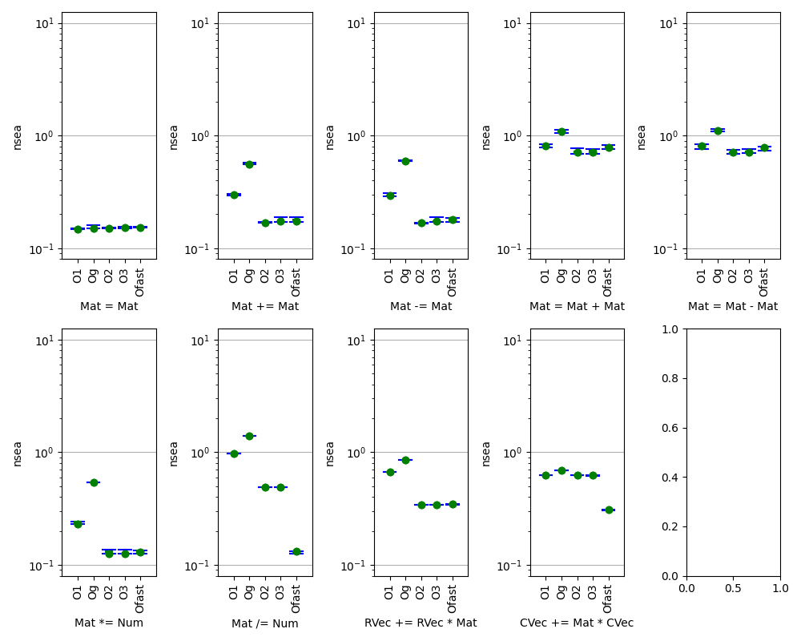

Benchmark Results with Plots

* Mat<R,C,double>

** Plots and Methodology

The goal of the mat benchmark program is to do several iterations
of the mat benchmark suite, all with the same R, and each taking
somewhere around a configured time to run.

To do this, we need to do two runs. The first run will have the usual
one-time-only Cold Cache penalty, but we use its elapsed time to tune
the R value for the second run. The second run is Warm Cache, and we
use its run time for the final tuning of R for the recorded runs.

Once a value of R is selected, the suite is run repeatedly until
the elapsed time exceeds the configured limit, and a summary of the
runs is generated.

** Set up tables to accumulate results by configuration

#+begin_src python :session :results output :var cols=bench_mat_cols
  tbl_O0 = []
  tbl_O1 = []
  tbl_Og = []
  tbl_O2 = []
  tbl_O3 = []
  tbl_Ofast = []
#+end_src

#+RESULTS:

** Incorporate Benchmark Results

Insert "benchmarks.log" here after running some benchmarks.

** Column Headers

#+tblname: bench_mat_cols
| min | 25% | 50% | 75% | max | operation |

** Python Code

*** imports

#+begin_src python :session :results none

  import math
  import matplotlib.pyplot as plt
  import matplotlib.patches as patches
  import numpy as np

#+end_src

*** def gen_dmap():

#+begin_src python :session :results none

  def gen_dmap(tables, tnames):
      dmap = {}
      oporder = []
      for tbl, name in zip(tables, tnames):
          for row in tbl:
              lo, q1, q2, q3, hi, op = row
              if op not in dmap:
                  oporder.append(op)
                  dmap[op] = {}
              dmap[op][name] = [lo, q1, q2, q3, hi]
      return dmap, oporder

#+end_src

*** def print_dmap(dmap, oporder, tnames):

#+begin_src python :session :results none

  def print_dmap(dmap, oporder, tnames, cols):
      cols[0][-1] = ""
      head = " | ".join([f"{x:8}" for x in cols[0]])
      dash = "-|-".join(["-"*8 for x in cols[0]])
      for op in oporder:
          if op not in dmap: continue
          dmap_op = dmap[op]
          print(f"")
          print(f"Nanoseconds per element for {op}:")
          print(f"| {head} |")
          print(f"|-{dash}-|")
          for name in tnames:
              if name not in dmap_op: continue
              s = " | ".join(f"{x:8.3f}" for x in dmap_op[name])
              print(f"| {s} | {name:8} |")

#+end_src

*** def plot_dmap(dmap, oporder, tnames, figname):

#+begin_src python :session :results none

  def plot_dmap(dmap, oprows, tnames, figname):
      opnr = len(oprows)
      opnc = 1
      for oprow in oprows:
          if opnc < len(oprow):
              opnc = len(oprow)
      fig, axes = plt.subplots(figsize=(2*opnc, 4*opnr), nrows=opnr, ncols=opnc)
      # TODO: what if nrows is 1?
      # TODO: what if ncols is 1?

      ymax = 1.0
      for opri, opr in enumerate(oprows):
        for opci, op in enumerate(opr):
          if op not in dmap: continue
          dmap_op = dmap[op]
          for name in tnames:
              if name not in dmap_op: continue
              dmin, d1, d2, d3, dmax = dmap_op[name]
              while ymax < dmax: ymax *= 10.0

      ymin = 0.1
      for opri, opr in enumerate(oprows):
        for opci, op in enumerate(opr):
          if op not in dmap: continue
          dmap_op = dmap[op]
          for name in tnames:
              if name not in dmap_op: continue
              dmin, d1, d2, d3, dmax = dmap_op[name]
              while ymin > dmin: ymin /= 10.0
      if ymin < 0.001: ymin = 0.001

      for opri, opr in enumerate(oprows):
        for opci, op in enumerate(opr):
          if op not in dmap: continue
          dmap_op = dmap[op]

          ax = axes[opri, opci]
          ax.set_xlabel(op)
          ax.set_ylabel("nsea")

          xtick_s = []
          xtick_x = []
          x = 0
          for name in tnames:
              x += 1
              if name not in dmap_op: continue
              data = dmap_op[name]
              dmin, d1, d2, d3, dmax = data

              x1 = x + 0.1
              x3 = x + 0.3
              x5 = x + 0.5
              x7 = x + 0.7
              x9 = x + 0.9

              sw = [x1, x9]
              sn = [x3, x7]

              xl = [x3, x3]
              xc = [x5, x5]
              xr = [x7, x7]

              xtick_x.append(x5)
              xtick_s.append(name)

              ax.plot(xl, [d1, d3], 'g')
              ax.plot(xr, [d1, d3], 'g')
              ax.plot(xc, [dmin, d1], 'b')
              ax.plot(xc, [d3, dmax], 'b')

              ax.plot(sw, [dmin, dmin], 'b')
              ax.plot(sw, [dmax, dmax], 'b')

              ax.plot(sn, [d1, d1], 'g')
              ax.plot(sn, [d3, d3], 'g')

              ax.plot([x5, x5], [d2, d2], 'go')

          ax.set_xlim(0.5, x+1.5)
          # OPTIONAL: use log scale
          ax.set_yscale('log', base=10)
          ax.set_ylim(ymin*0.80, ymax*1.25)
          # ax.set_ylim(0.0, ymax*1.25)
          ax.tick_params(axis='x', labelsize=10)
          ax.grid(axis='y')
          ax.set_xticks(xtick_x, xtick_s, rotation=90)

      plt.tight_layout()

      plt.savefig(figname)
#+end_src

*** def median_for_name(dmap_op, name, refdata):

#+begin_src python :session :results none

  def median_for_name(dmap_op, name, refdata):
      result = "-"
      result = f"{result:>8}"
      if name in dmap_op:
          dmap_op_name = dmap_op[name];
          if len(dmap_op_name) > 2:
              result = dmap_op_name[2] / refdata
              result = f"{result:8.2f}"
      return result

#+end_src

*** def print_relative_time(dmap, oporder, tnames, ref):

#+begin_src python :session :results none

  def print_relative_time(dmap, oporder, tnames, ref):
      print()
      print(f"Time relative to {ref} (smaller is better):")

      if ref not in tnames:
          ref = tnames[0]

      op = "operation"
      print(f"| {op:32}", end=' ')
      for name in tnames:
          print(f"| {name:>8}", end=' ')
      print("|")

      op = "-" * 32;
      print(f"|-{op:32}", end='-')
      for name in tnames:
          name = "-" * 8;
          print(f"|-{name:>8}", end='-')
      print("|")

      for op in oporder:
          if op not in dmap: continue
          dmap_op = dmap[op]
          refdata = dmap_op[ref][2] if ref in dmap_op else dmap_op[tnames[0]][2];
          strs = " | ".join(
              [median_for_name(dmap_op, name, refdata)
               for name in tnames])
          print(f"| {op:32} | {strs} |")
#+end_src

*** def inv_median_for_name(dmap_op, name, refdata):

#+begin_src python :session :results none

  def inv_median_for_name(dmap_op, name, refdata):
      result = "-"
      result = f"{result:>8}"
      if name in dmap_op:
          dmap_op_name = dmap_op[name];
          if len(dmap_op_name) > 2:
              result = refdata / dmap_op_name[2]
              result = f"{result:8.2f}"
      return result

#+end_src

*** def print_relative_speed(dmap, oporder, tnames, ref):

#+begin_src python :session :results none

  def print_relative_speed(dmap, oporder, tnames, ref):
      print()
      print(f"Speed relative to {ref} (larger is better):")

      op = "operation"
      print(f"| {op:32}", end=' ')
      for name in tnames:
          print(f"| {name:>8}", end=' ')
      print("|")

      op = "-" * 32;
      print(f"|-{op:32}", end='-')
      for name in tnames:
          name = "-" * 8;
          print(f"|-{name:>8}", end='-')
      print("|")

      for op in oporder:
          if op not in dmap: continue
          dmap_op = dmap[op]
          refdata = dmap_op[ref][2] if ref in dmap_op else dmap_op[tnames[0]][2]
          strs = " | ".join(
              [inv_median_for_name(dmap_op, name, refdata)
               for name in tnames])
          print(f"| {op:32} | {strs} |")

#+end_src

** make the plots and re-print the data

#+begin_src python :session :results output

  tables = [tbl_O0, tbl_O1, tbl_Og, tbl_O2, tbl_O3, tbl_Ofast]
  tnames = ["O0",   "O1",   "Og",   "O2",   "O3",   "Ofast"  ]

  dmap, oporder = gen_dmap(tables, tnames)

  # print(f"{oporder = !r}")
  # print(f"{dmap = !r}")

  print_relative_time(dmap, oporder, tnames, 'Og')
  print_relative_speed(dmap, oporder, tnames, 'Og')

  print_dmap(dmap, oporder, tnames, cols)

  # OPTIONAL: discard O0 results from plot
  tables = tables[1:]
  tnames = tnames[1:]

  # OPTIONAL: discard "init with rand()" resultsfrom plot
  oporder = [x for x in oporder if "init with rand" not in x]

  # Control the arrangement of the subplots.
  # For now, just lay them out in rows of five.
  # Later, we may want to have some specific
  # patterns in the op names that cause us to
  # break to the next row? Apply YAGNI for now.

  oprows = []
  for i in range(0, len(oporder), 5):
      oprows.append(oporder[i:i+5])

  plot_dmap(dmap, oprows, tnames, "benchmarks.png")

#+end_src

#+RESULTS:
: 
: Time relative to Og (smaller is better):
: | operation                        |       O0 |       O1 |       Og |       O2 |       O3 |    Ofast |
: |----------------------------------|----------|----------|----------|----------|----------|----------|
: 
: Speed relative to Og (larger is better):
: | operation                        |       O0 |       O1 |       Og |       O2 |       O3 |    Ofast |
: |----------------------------------|----------|----------|----------|----------|----------|----------|

